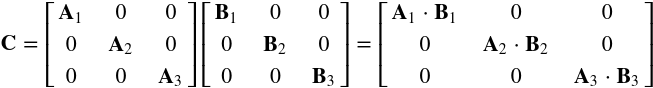

# Flash Attention Tutorial




Welcome to the Flash Attention Tutorial repository! This repository provides an in-depth tutorial on the concept of Flash Attention, including high-level intuition, detailed explanation, and practical implementation.

## Repository Overview

- **Notebook**: [Flash Attention.ipynb](https://github.com/galenwilkerson/Flash-Attention-Tutorial/blob/main/Flash%20Attention.ipynb)
  - This Jupyter Notebook contains all the tutorial content, including explanations and code implementations.

## Contents

1. **Introduction**
   - Overview of attention mechanisms and their significance in neural networks.
   - High-level intuition behind Flash Attention.

2. **Detailed Explanation**
   - In-depth discussion on how Flash Attention reduces memory usage, speeds up computations, and maintains accuracy.
   - Comparison with traditional attention mechanisms.

3. **Implementation**
   - Step-by-step implementation of Flash Attention using PyTorch.
   - Example usage and demonstration of the implemented Flash Attention mechanism.

## Key Features

- **Efficient Memory Usage**: Learn how Flash Attention minimizes memory requirements by processing smaller chunks of the sequence.
- **Enhanced Computational Speed**: Understand how modern hardware capabilities and optimized memory access patterns improve computation time.
- **Maintained Accuracy**: See how Flash Attention retains the accuracy of traditional attention mechanisms while offering efficiency improvements.

## Usage

1. **Clone the Repository**

   ```bash
   git clone https://github.com/galenwilkerson/Flash-Attention-Tutorial.git
   cd Flash-Attention-Tutorial
   ```

2. **Open the Jupyter Notebook**

   Launch Jupyter Notebook in your terminal:

   ```bash
   jupyter notebook
   ```

   Navigate to `Flash Attention.ipynb` and open it to start exploring the tutorial.

## Requirements

- **Python**: 3.6 or higher
- **PyTorch**: 1.7.0 or higher
- **Jupyter Notebook**: 6.0.3 or higher

You can install the required packages using `pip`:

```bash
pip install torch jupyter
```

## Contributing

We welcome contributions to improve this tutorial. If you have suggestions or find any issues, please feel free to create a pull request or open an issue.

## License

This project is licensed under the MIT License.

---

We hope you find this tutorial helpful and insightful! Happy learning and coding!

---

Galen Wilkerson

---

Feel free to explore the notebook and enhance your understanding of Flash Attention!

